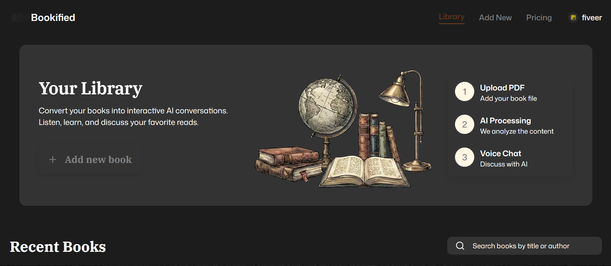

# 📚 Bookified AI

<div align="center">




### 🎙️ Voice-First AI Platform for Conversational Learning

Upload PDF books, chat with them using AI voice, generate summaries, and transform reading into an interactive learning experience.

</div>

---

# 📖 Overview

**Bookified AI** is a modern AI-powered platform that transforms traditional PDF books into intelligent conversational companions.

Instead of simply reading static content, users can upload books, ask questions through natural voice conversations, generate AI-powered summaries, and interact with personalized voice assistants.

Built with **Next.js 16**, **Vapi**, **ElevenLabs**, **MongoDB**, **Clerk**, **Tailwind CSS**, and **shadcn/ui**, the platform demonstrates the integration of conversational AI, voice synthesis, and intelligent document retrieval into a scalable full-stack application.

---

# ✨ Core Features

## 📄 Intelligent PDF Processing

Transform PDFs into searchable AI knowledge bases.

### Features

- Upload PDF books
- Automatic text extraction
- Intelligent document chunking
- Context-aware embeddings
- Fast semantic retrieval

---

## 🎙️ Real-Time Voice Conversations

Have natural conversations with your books.

### Features

- Voice-first interactions
- Ask questions naturally
- AI-generated spoken responses
- Low-latency conversations powered by Vapi

---

## 🧠 AI Voice Personas

Choose your preferred AI reading companion.

### Features

- Multiple AI personalities
- High-quality voice synthesis
- Instant voice previews
- Powered by ElevenLabs

---

## 📖 Smart Summaries & Insights

Understand books faster.

### Features

- Chapter summaries
- Topic explanations
- Key concept extraction
- AI-generated insights

---

## 📝 Live Session Transcripts

Keep every conversation.

### Features

- Automatic transcripts
- Session history
- Search previous conversations
- Learning review

---

## 📚 Personal Library

Manage your AI-powered collection.

### Features

- Organize uploaded books
- Search your library
- Browse global collections
- Fast content discovery

---

## 🔐 Authentication & Subscriptions

Secure and scalable user management.

### Features

- Email & Social Authentication
- Protected routes
- Subscription plans
- Premium feature support

---

# 🛠️ Tech Stack

## ⚛️ Frontend

- Next.js 16
- React
- TypeScript
- Tailwind CSS
- shadcn/ui

---

## 🗄️ Backend

- MongoDB
- Server Actions
- API Routes

---

## 🎙️ AI & Voice

- Vapi AI
- ElevenLabs
- Retrieval-Augmented Generation (RAG)

---

## 🔐 Authentication

- Clerk

---

# 🚀 Getting Started

## 1️⃣ Clone the Repository

```bash
git clone https://github.com/yourusername/bookified-ai.git

cd bookified-ai
```

---

## 2️⃣ Install Dependencies

```bash
npm install
```

---

## 3️⃣ Configure Environment Variables

Create a `.env.local` file:

```env
NODE_ENV='development'
NEXT_PUBLIC_BASE_URL=localhost:3000

# CLERK
NEXT_PUBLIC_CLERK_PUBLISHABLE_KEY=
NEXT_PUBLIC_CLERK_SIGN_IN_URL=/sign-in
NEXT_PUBLIC_CLERK_SIGN_UP_URL=/sign-up
NEXT_PUBLIC_CLERK_SIGN_IN_FALLBACK_REDIRECT_URL=/
NEXT_PUBLIC_CLERK_SIGN_UP_FALLBACK_REDIRECT_URL=/


# VERCEL BLOB
bookifiedai_STORE_ID=
bookifiedai_READ_WRITE_TOKEN=

# MONGODB
MONGODB_URI=

# VAPI
NEXT_PUBLIC_VAPI_API_KEY=
VAPI_SERVER_SECRET=

# Google Gemini API for embeddings
GOOGLE_GEMINI_API_KEY=

# ELEVENLABS
ELEVENLABS_API_KEY=
```

---

## 4️⃣ Start Development Server

```bash
npm run dev
```

Open:

```
http://localhost:3000
```

---

# 🔄 System Architecture

```text
             User
               │
               ▼
     Next.js Frontend (UI)
               │
               ▼
     Clerk Authentication
               │
               ▼
       PDF Upload & Processing
               │
               ▼
   Embeddings & Context Retrieval
               │
               ▼
         MongoDB Storage
               │
               ▼
      AI Response Generation
               │
      ┌────────┴────────┐
      ▼                 ▼
   Vapi AI        ElevenLabs
 (Conversation) (Voice Synthesis)
      │                 │
      └────────┬────────┘
               ▼
     Real-Time Voice Response
```

---

# 🌟 Key Highlights

- 🎙️ Real-time AI voice conversations
- 📚 Intelligent PDF understanding
- 🧠 AI-generated summaries & insights
- 🎭 Multiple AI voice personas
- 📝 Automatic conversation transcripts
- 📂 Smart library management
- 🔐 Secure authentication with Clerk
- 💳 Subscription-ready architecture
- ⚡ Modern UI with shadcn/ui & Tailwind CSS
- 🚀 Scalable full-stack architecture

---

# 💡 What This Project Demonstrates

This project showcases expertise in:

- AI-powered web applications
- Voice AI integration
- Full-stack Next.js development
- RAG (Retrieval-Augmented Generation)
- MongoDB data modeling
- Authentication & user management
- Modern UI/UX development
- Scalable SaaS architecture

---

# 🚀 Future Improvements

- 🌍 Multi-language voice support
- 📱 Mobile application
- 🤝 Collaborative reading sessions
- 📒 AI-generated study notes
- 📈 Learning analytics dashboard
- 🎯 Personalized book recommendations

---

# ❤️ Final Note

Bookified AI transforms traditional reading into an interactive AI-powered learning experience. By combining conversational AI, intelligent document retrieval, and natural voice synthesis, it enables users to learn through engaging, real-time conversations with their books.

---

<div align="center">

## 📚 The Future of Reading is Conversational

**Next.js • Vapi • ElevenLabs • MongoDB • Clerk 🚀**

</div>